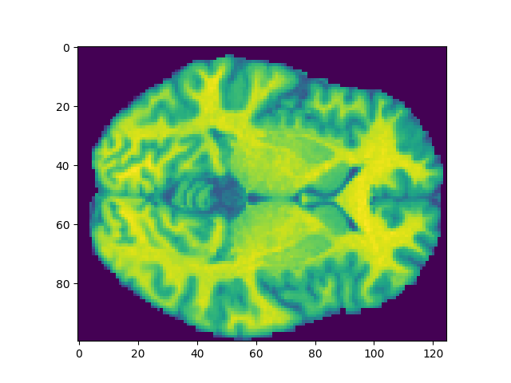
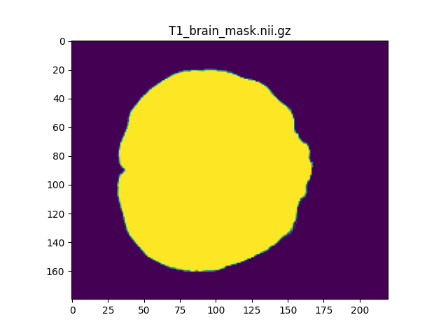
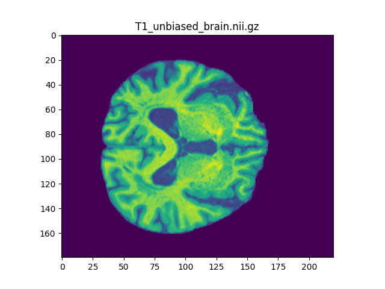
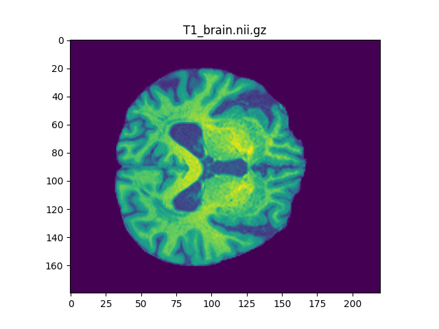
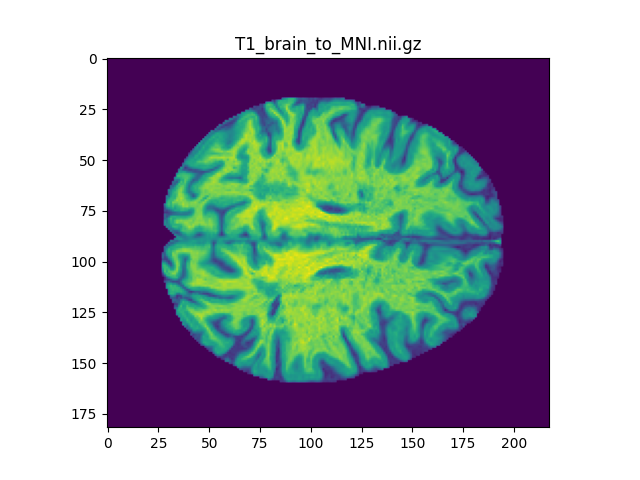

### CSV file 
already available
- Age at recruitment at Data-Field 21022:

`
    csv = pd.read_csv('/mnt/qdata/rawdata/UKBIOBANK/ukbdata/ukb46167.csv', nrows=50)
    ages = csv.loc[:, csv.columns.str.contains('21022')]
`   

### Data loader NAKO
info = CSV file
keys = Patient IDs used for training, test, val
data: /mnt/qdata/share/raheppt1/data/brainage/nako/interim/t1_pp_15_*.h5

### Data
#### NAKO

after Tobi's pre-processing: N4 bias field correction, FLIRT MNI152 coregistration, ROBEX skull stripping, FCM WM intensity normalization

#### UK Biobank 

